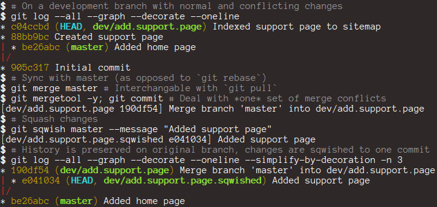

# git-sqwish [](https://travis-ci.org/twolfson/git-sqwish)

git squash without repetitive conflicts

Designed for use with `git merge` during development and avoid `git rebase`'s repetitive conflicts altogether.



## Installation
One line install:

```bash
(cd /tmp && git clone --depth 1 https://github.com/twolfson/git-sqwish && cd git-sqwish && sudo make install)
```

Manual install:

```bash
$ # Clone the repository
$ git clone --depth 1 https://github.com/twolfson/git-sqwish
Cloning into 'git-sqwish'...
...
Resolving deltas: 100% (13/13), done.
$ # Go into the directory
$ cd git-sqwish
$ # Install the script
$ sudo make install
... installing bins to /usr/local/bin
... installing man pages to /usr/local/share/man/man1
... installing git-sqwish
cp -f man/git-*.1 "/usr/local/share/man/man1"
cp -f etc/bash_completion.sh /etc/bash_completion.d/git-sqwish
$ git sqwish # Now available for invocation
```

## Architecture
`git-sqwish` takes the same vision as your normal squash technique (`git rebase` + `git rebase -i`). The end goal is to have all applied changes on top of the latest `master` branch. The high level details are:

1. Verify current branch is clean
2. Verify current branch is ahead of `master` and won't conflict with a dry merge
3. Checkout `.sqwished` branch based off of `master`
4. Copy state of files from original branch to `.sqwished` branch
5. Collect commit messages from original branch into collective commit message
6. If `message` was not provided, open `commit` prompt with collective message
7. Commit changes to `.sqwished` branch

## FAQs
### Can we squash changes without moving to a new branch?
A secondary branch is always required for this approach. However, [git-extras][] implements a `git-squash` that returns to the original branch.

```bash
git squash --me
```

## Attribution
`man/Readme.md`, `man/manning-up.sh`, and `Makefile` are forked from [git-extras][], a broader collection of `git` utilities. Those files are [licensed under the MIT License][git-extras-license].

[git-extras]: https://github.com/visionmedia/git-extras
[git-extras-license]: https://github.com/visionmedia/git-extras/blob/a55cc84a1145936535e00153ac4cdd6a1f6812cc/LICENSE

## Donating
Support this project and [others by twolfson][gittip] via [gittip][].

[![Support via Gittip][gittip-badge]][gittip]

[gittip-badge]: https://rawgithub.com/twolfson/gittip-badge/master/dist/gittip.png
[gittip]: https://www.gittip.com/twolfson/

## Unlicense
As of Sep 24 2013, Todd Wolfson has released this repository and its unattributed contents to the public domain.

It has been released under the [UNLICENSE][].

[UNLICENSE]: UNLICENSE
